# Add an inbound OAuth Provider

## Goal

You will create a new OAuth provider in ServiceNow and get a Client ID and
Client Secret for later use.

### Log in to your instance

If you have not done so already, log into your lab instance using the admin
credentials printed on the front of this lab guide.

### Select the "My Work" app

The My Work update set that accompanies the Node.js application has been
pre-loaded into your lab instance. Before you create an OAuth provider, you must
first set **My Work** as the active application.

1.  Click the **System Settings** icon (cog wheel) in the upper right corner of
    the ServiceNow UI.

2.  Click the **Developer** menu.

3.  Change the active application from **Global** to **My Work**.

    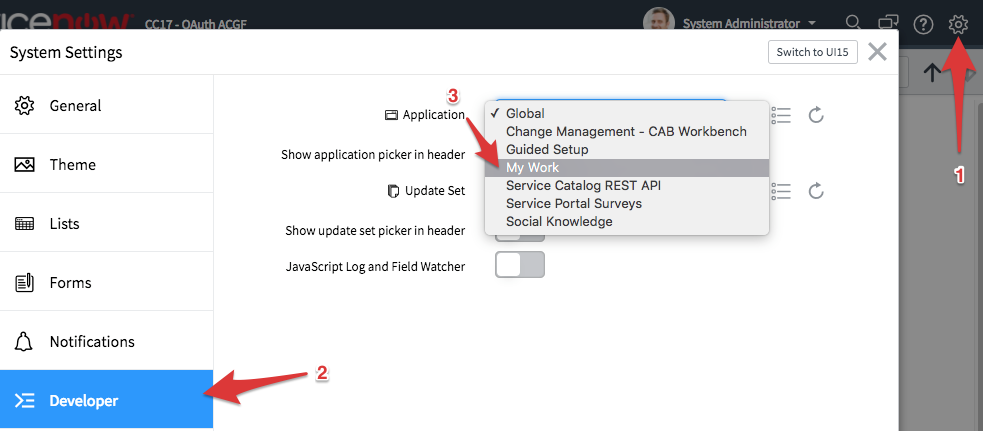

## Create the provider

1.  Navigate to **System OAuth \> Application Registry** and click the **New**
    button.

    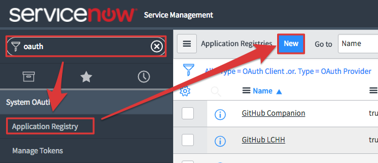

2.  Click **Create an OAuth API endpoint for external clients**.

3.  Name the provider **CC17 My Work App**, set the Client Secret to
    **Knowledge17** and set the Redirect URL to
    `https://www.getpostman.com/oauth2/callback`

    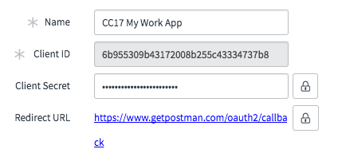

4.  **Save** the record and make note of the **Client ID** and **Client Secret**
    values. You will need these in the upcoming labs.

**Note**: The redirect URL will normally be a resource inside the application
connecting to ServiceNow as a client. In Lab 2, we'll be using **Postman** to
test the provider, and this is why we're using the getpostman.com Redirect URL.
You will update this redirect URL in a future lab.

# Use Postman to test the new provider

## Goal

Postman is an API testing tool. It's always a good idea to test your OAuth
configurations in a tool like Postman or Paw before attempting to write code. In
this lab, you will use Postman to test the new OAuth provider you created in
ServiceNow.

### Create a GET request in Postman

1.  If you do not already have Postman installed, download and install it from
    https://www.getpostman.com/.

2.  Create a new `GET` request with the following URL:

    `https://yourinstance.lab.service-now.com/api/now/v1/table/incident`

3.  Click the **Send** button, and note the resulting 401 error.

    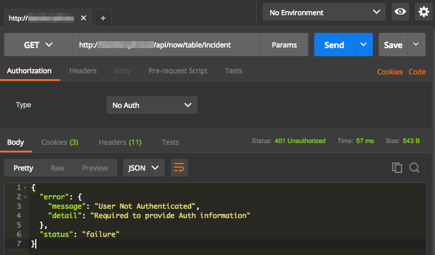

## Configure the GET request to use OAuth

1.  Under the **Authorization** tab, change the **Type** to **OAuth 2.0** and
    click **Get New Access Token**.

    

2.  Fill out the OAuth Configuration dialog with the following values:

    -   Token name: **CC17 My Work App**

    -   Auth URL: **https://yourinstance.lab.service-now.com/oauth_auth.do**

    -   Access Token URL:
        **https://yourinstance.lab.service-now.com/oauth_token.do**

    -   Client ID: **Value saved from Lab 1**

    -   Client Secret: **Value saved from Lab 1**

    -   Scope: **useraccount**

    -   Grant Type: **Authorization Code**

    -   Request access token locally: **Unchecked**

    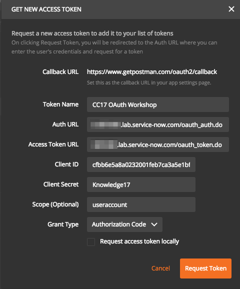

3.  Click the **Request Token** button and a ServiceNow login/authorization
    window will open.

4.  Log in if necessary.

5.  When prompted, click **Allow** to grant Postman access to the instance.

6.  Postman will now list a token called **CC17 OAuth Workshop**. Click this
    token, make sure **Header** is selected under "Add token to" and then click
    the **Use Token** button in the detail pane.

    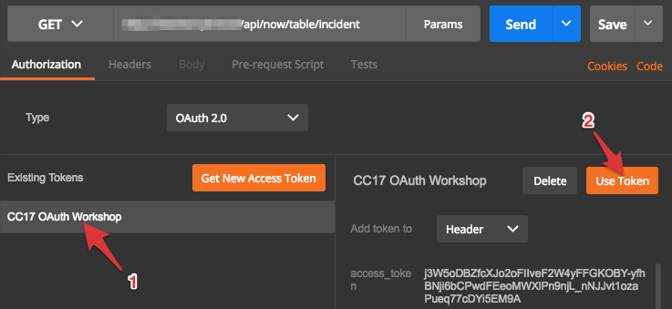

7.  Click the **Send** button again to retry the request. This time, you will
    get a real result from ServiceNow.

# Get the Node.js My Work app up and running

## Goal

Before you start adapting the My Work app to work with OAuth, you need to get it
up and running! We will be using Glitch, an online Node.js environment that
gives you the tools build a Node app without installing anything on your
computer.

### "Remix" the CC17 OAuth Glitch Project

1.  Navigate to `https://glitch.com/~cc17-oauth-mywork`.

2.  Click the **Remix your own** button to copy the project and get your own
    version of all of the files.

    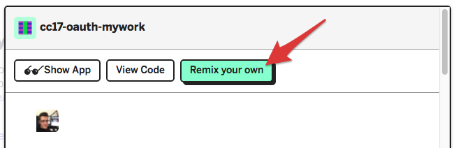

3.  Click **Sign in** and use the **Sign in with GitHub** option to preserve the
    changes you will make during the rest of this lab.

    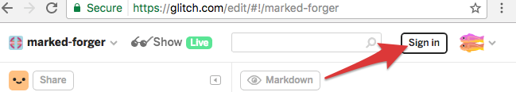

4.  Glitch automatically assigned your project a random name and started the
    server process. Click the **Show Live** button to launch the My Work app in
    a new browser tab.

    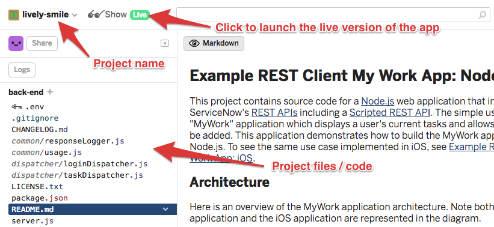

5.  In the **Servicenow instance name** field, enter the name of your lab
    instance.

6.  Log in using your lab instance username/password.

    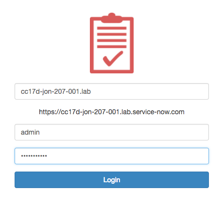

7.  You should now see a list of tasks.

    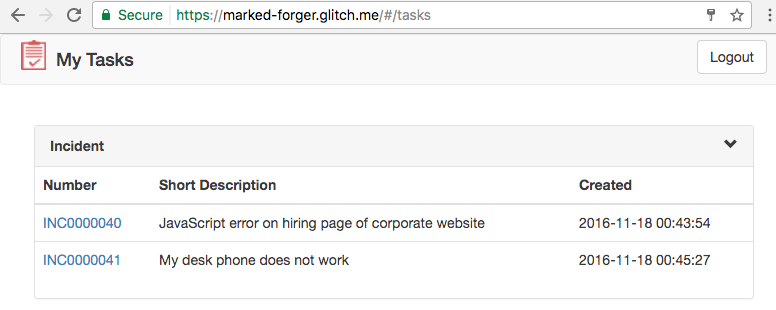

# Install Passport.js, New Routes, Config File

## Lab Goal

You will modify the Node project to include the Passport dependencies, add new
routes to server.js and create a configuration file to store OAuth configuration
information.

### Add Passport dependencies

Passport.js (http://passportjs.org/) is authentication middleware for Node.js.
In this lab, you will use it to add support for OAuth in the My Work Node.js
app.

## Modify package.json

1.  In the Glitch UI, open `package.json`.

2.  Click the **Add package** button and search for **passport**.

    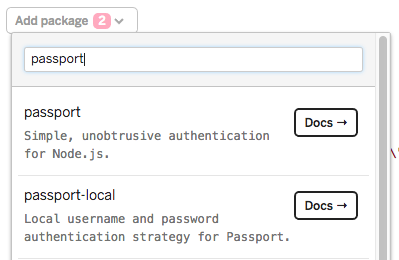

3.  Click the **passport** entry in the list of results to add it to
    package.json. You will now see passport listed with the other dependencies.

    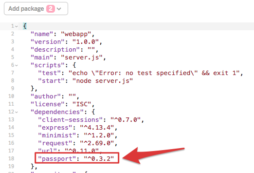

4.  Repeat these steps to add `passport-oauth` as a dependency.

## Add a configuration file

When working with OAuth, there are a number of configuration values that you
will need to store for use elsewhere in the application.

1.  Create a new file named `config.js`.

    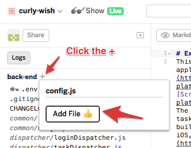

2.  Add the following code to `config.js`:

    **Note:** This code can also be copied from [`Lab4_1_config.js`](https://github.com/ServiceNowEvents/K17-CCW3959-code/blob/master/Lab4_1_config.js).

    ```javascript
    var config = {};  

    // Replace <instance> with your Lab Instance prefix
    config.instanceURL = 'https://<instance>.service-now.com';   

    // OAuth Configuration  
    config.oauth = {};  
    config.oauth.authURL      = config.instanceURL + '/oauth_auth.do';  
    config.oauth.tokenURL     = config.instanceURL + '/oauth_token.do';  

    // Replace <glitch-project> with your project name
    config.oauth.callbackURL  = 'https://<glitch-project>.glitch.me/auth/provider/callback';  

    module.exports = config; 
    ```

3.  Update `config.instanceURL` to point at your Lab instance URL.

4.  Update `config.oauth.callbackURL` to point at your Glitch project.

## Add Client ID / Secret to `.env`

In order to keep the Client ID and Secret safe, we are going to save them in a
special area provided by Glitch used to store sensitive values.

1.  Open the `.env` file listed at the top of the project files list.

    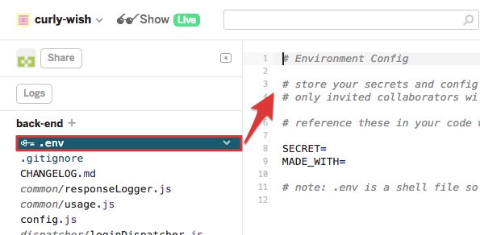

2.  Add the following lines:

    ```Shell
    OAUTH_CLIENT_ID=<Replace with Client ID from OAuth Provider> 
    OAUTH_CLIENT_SECRET=<Replace with Client Secret from OAuth Provider> 
    ```

3.  Update the values to reflect the Client ID and Client Secret from the OAuth
    provider you created earlier.

## Initialize Passport in `server.js`

Now that the Passport dependency has been established, you will need to
initialize Passport in `server.js`.

1.  Open `server.js`.

2.  Find this comment block.

    ```javascript
    // ********************************************************
    // Lab 4 - Add the Initialization Code After This Comment *
    // ********************************************************
    ```

3.  Add the following code after the comment block.

    **Note:** This code can also be copied from [`Lab4_2_server_js_initialize_passport.js`](https://github.com/ServiceNowEvents/K17-CCW3959-code/blob/master/Lab4_2_server_js_initialize_passport.js).

    ```javascript
    // Set up Passport  
    var config = require('./config');  
    var passport = require('passport')  
    , OAuth2Strategy = require('passport-oauth').OAuth2Strategy;  

    app.use(passport.initialize());  

    passport.use('provider', new OAuth2Strategy({  
        authorizationURL: config.oauth.authURL,  
        tokenURL:         config.oauth.tokenURL,  
        clientID:         process.env.OAUTH_CLIENT_ID,  
        clientSecret:     process.env.OAUTH_CLIENT_SECRET,  
        callbackURL:      config.oauth.callbackURL  
    }, function(accessToken, refreshToken, profile, done) {  
            var tokenInfo = {};  
            tokenInfo.accessToken  = accessToken;  
            tokenInfo.refreshToken = refreshToken;  
            tokenInfo.profile      = profile;  
            console.log(tokenInfo);  
            done(null, tokenInfo);  
        }  
    ));  

    passport.serializeUser(function(user, done) {  
        done(null, user);  
    });  

    passport.deserializeUser(function(id, done) {  
        done(null, id);  
    });  
    ```

## Add new OAuth Routes

In order to initiate an OAuth flow from Express, we need to create two new
routes. A route is just a "path" in the web application.

### `/auth/provider`

When users navigate to this route, Passport will redirect them to the configured
OAuth Authorization endpoint (`/oauth_auth.do` in ServiceNow). Passport will
handle the process of constructing the full authorization URL including the
desired **Response Type**, **Client ID** and **Redirect URL**.

### `/auth/provider/callback`

When the user authorizes the request in ServiceNow, ServiceNow will redirect
them to back to this callback URL. Passport will then read the `code` parameter
sent by ServiceNow and use it to retrieve an Access Token.

1.  Open `server.js`.

2.  Find this comment block.

    ```javascript
    // ***********************************************
    // Lab 4 - Add the Route Code After This Comment *
    // ***********************************************
    ```

3.  Add the following code after the comment block:

    **Note:** This code can also be copied from [`Lab4_3_server_js_add_routes.js`](https://github.com/ServiceNowEvents/K17-CCW3959-code/blob/master/Lab4_3_server_js_add_routes.js)``].

    ```javascript
    // Passport Routes  
    router.get('/auth/provider',          passport.authenticate('provider'));  
    router.get('/auth/provider/callback', passport.authenticate('provider', { failureRedirect: '/login' }), 
        function(req, res) {
        res.cookie('loggedIn', 'true'); 
        res.redirect(301, '/#/tasks'); 
        }
    ); 
    ```

## Update the OAuth Provider in ServiceNow

1.  Open the **CC17 My Work App** OAuth Provider Record.

2.  Change the **Redirect URL** to
    `https://<glitch-project>.glitch.me/auth/provider/callback` (replace with
    the name of your project).

### Test the new routes

Navigate to https://glitch-project.glitch.me/auth/provider (replace
**glitch-project** with **your** project name). If everything worked correctly,
you will be redirected to your Lab Instance and asked to authorize the Node.js
Application. After authorizing the request, you will be redirected back to your
Glitch app, but you will be greeted by the login screen or an "Unauthorized"
error message. This is expected, and you will address this in Lab 5.

To verify that a token was successfully retrieved, open the application log and
look for output showing the Access Token and Refresh Token returned by
ServiceNow.


# Modify code to use Access Tokens

## Goal

Even though you have successfully authorized the application and have retrieved
an access token, the integration code that **calls** the APIs is still using
Basic Auth. In this lab, you will update the code in `taskDispatcher.js` and
`task.js` to use Access Tokens.

## Modify `taskDispatcher.js`

1.  Open `dispatcher/taskDispatcher.js`.

2.  At the top of the file, add the following code:

    ```javascript
    var config = require('../config.js'); 
    ```

3.  Replace the first four lines of the `getTasks` method with the following
    code:

    **Note:** This code can also be copied from [`Lab5_1_taskDispatcher_js_four_lines.js`](https://github.com/ServiceNowEvents/K17-CCW3959-code/blob/master/Lab5_1_taskDispatcher_js_four_lines.js).

    ```javascript
    var session = serverRequest.session;
    if (session && session.passport && session.passport.user.accessToken) {
        var SNTask = serverRequest.app.get('snTask');
        var options = serverRequest.app.get('options');
        var snTask = new SNTask(config.instanceURL, session.passport.user.accessToken, options);
    ```

## Modify `task.js`

1.  Open `sn_api/task.js`.

2.  Replace the `Task` function definition with the following code:

    ```javascript
    function Task(snInstanceURL, accessToken, options) {
        this.snInstanceURL = snInstanceURL; 
        this.accessToken = accessToken; 
        this.options = options; 
    }
    ```

3.  In the `getTasks()` method, find this code block:

    ```javascript
    // ****************************************************
    // Lab 5 - Replace the three lines after this comment *
    // ****************************************************
    headers: {
        'Cookie': this.snCoookie
    }
    ```

4.  Replace the three lines after the comment with:

    ```javascript
    auth: { 
        bearer: this.accessToken 
    }
    ```

Complete versions of all files can be found at <https://github.com/ServiceNowEvents/K17-CCW3959-code>.

## Test the updated code

The modifications we made incorporate the Access Token retrieved by Passport
into the API calls that retrieve tasks from ServiceNow. To test this, follow
these steps:

1.  Navigate to `http://<glitch-project>.glitch.me/auth/provider`.

2.  Complete the OAuth authorization flow.

3.  When redirected back to the My Work app, you should now see a list of tasks!

##### Congratulations! You have successfully adapted the application to acquire and use OAuth Access Tokens.

# Bonus - Modify addComment() and getComments()

## Goal

Using the previous exercise as a guide, adapt the `addComment()` and `getComments()` methods
to use the OAuth Token instead of Basic Auth.

# Bonus - Automatically Redirect

## Goal

Even though you've implemented Auth Code Grant Flow, the application still
redirects you to the legacy login page by default. In this lab, find the code
that redirects to to the `/login` route and change it to use the new
`/auth/provider` route.

\*\* Hint: Take a look at `public/js/app.js` \*\*.
